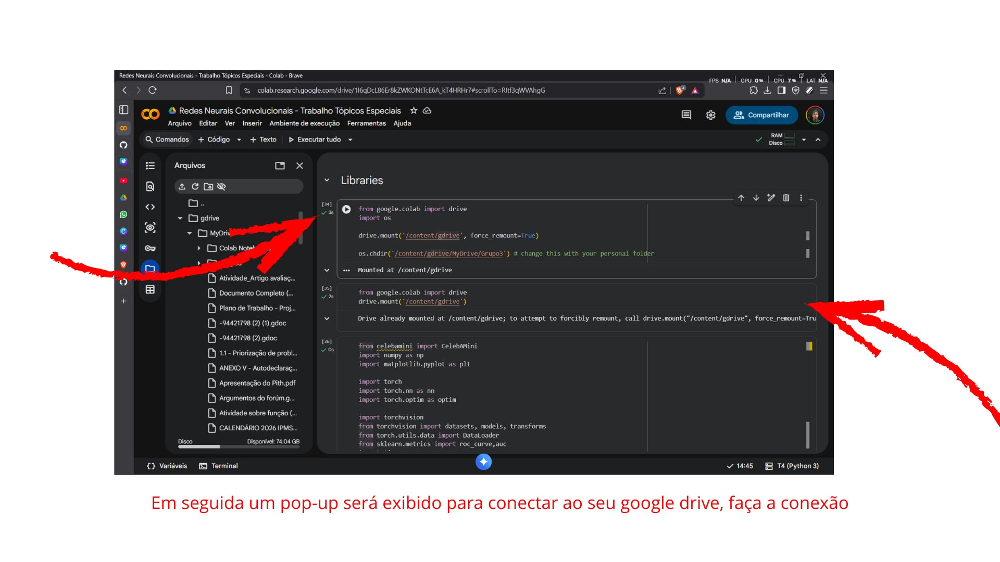
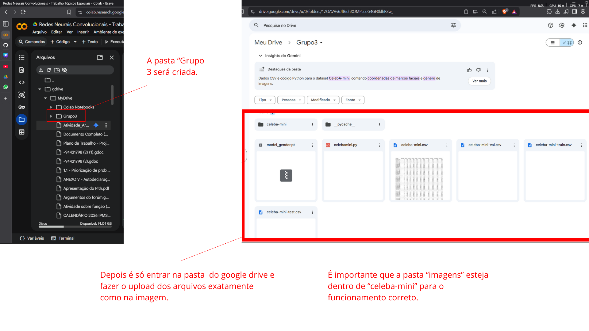

# Celebamini Gender Classifier

<h2>Antes de tudo, siga o passo a passo a baixo para adicionar o script em um novo projeto notebook-lm:</h2>

Clique em "Abrir Notebook":


Depois clique em "Upload" e em "Procurar":


Rode as duas primeiras celulas:



Observe que uma pasta nova foi criada, você deve fazer o upload via drive corretamente:



Verifique novamente o caminho para as pastas:


Fazendo esse passo a passo, o projeto está quase 100% para ser utilizado! 🥳⚡

# ☢️❌ Algumas prevenções de erro: 

Em alguns casos, como foi o meu, o arquivo ```cebelamini.py``` ficou bugado por conta de alguns erros que tinham no código. A baixo vou mostrar como resolver esses erros.


Primeiro erro (e mais simples): Espaçamento incorreto no ```cebelamini.py```:


Segundo erro mais comum: Condições do ```cebelamini.py``` duplicadas:


Seguindo todo esse passo a passo, acredito que dê tudo certo pra vcs familia. Tmj demais 🙂👊

# Documentação do código

<h2>1. Visão Geral do Projeto</h2>

<p>Este projeto implementa uma Rede Neural Convolucional (CNN) para classificar o gênero (Feminino/Masculino) de pessoas baseando-se em imagens faciais. O modelo utiliza a técnica de Transfer Learning com a arquitetura ResNet-18.</p>

<ul>
    <li>Classificação binária de imagens (0: Feminino, 1: Masculino).</li>
    <li>Dataset: CelebA-Mini (subamostra do dataset CelebA).</li>
    <li>Framework: PyTorch.</li>
    <li>Ambiente: Google Colab.</li>
</ul>

<h2>2. Estrutura dos Arquivos e Dados</h2>

<p>O projeto depende da seguinte organização de arquivos para funcionar corretamente:</p>

```python
/
├── Grupo3_Gender_classifier.ipynb  # Notebook principal de treinamento e teste
├── celebamini.py                   # Script auxiliar para carregar o dataset (DataLoader)
└── celeba-mini/                    # Pasta raiz dos dados
    ├── images/                     # Contém as imagens .jpg
├── celeba-mini-train.csv           # Rótulos de treino
├── celeba-mini-val.csv             # Rótulos de validação
├── celeba-mini-test.csv            # Rótulos de teste
└── celeba-mini.csv                 # Arquivo geral

```
```python
<p>Nota de Correção: O arquivo celebamini.py requer uma correção nas condicionais de carregamento (if/elif) para separar corretamente os conjuntos de validação e teste, como exemplifiquei acima.</p>

```

<h2>3. Pré-requisitos e Bibliotecas</h2>
<p>As seguintes bibliotecas Python são necessárias para execução:</p>

<ul>
    <li>PyTorch (torch, torchvision): Construção e treinamento da rede neural.</li>
    <li>Pandas: Manipulação dos arquivos CSV de anotações.</li>
    <li>Pillow (PIL): Carregamento e processamento de imagens.</li>
    <li>Scikit-learn: Cálculo de métricas de avaliação (F1-score, ROC, Matriz de Confusão).</li>
    <li>Matplotlib: Visualização de gráficos e resultados.</li>
    <li>Tqdm: Barra de progresso para o treinamento.</li>
</ul>

<h2>4. Arquitetura do Modelo</h2>
<p>O modelo baseia-se na ResNet-18 pré-treinada no imageNet.</p>

<ul>
    <li>Entrada: Imagens transformadas em tensores (PyTorch Tensor).</li>
    <li>Backbone: ResNet-18 (camadas convolucionais congeladas ou ajustadas, dependendo da configuração de pesos).</li>
    <li>Camada Final (Fully Connected): A última camada original da ResNet (que classifica 1000 classes) foi substituída para atender ao problema binário:</li>

    ```python
        model.fc = nn.Linear(num_features, 2) # Saída: 2 neurônios (Feminino, Masculino)
    ```
<li>Função de Perda: CrossEntropyLoss (adequada para classificação).</li>
    <li>Otimizador: Adam (Taxa de aprendizado: 0.0001).</li>
</ul>

<h2>5. Hiperparâmetros de Treinamento</h2>
<p>Configurações utilizadas durante o processo de treino:</p>

<ul>
    <li>Batch Size (Tamanho do Lote): 32</li>
    <li>Número de Épocas: 10</li>
    <li>Device: GPU (CUDA) se disponível, caso contrário CPU.</li>
    <li>Workers: 2 (para carregamento de dados em paralelo).</li>
</ul>

<h2>6. Pipeline de Execução</h2>
<p>O notebook segue o seguinte fluxo:</p>

<ul>
    <li>Carregamento: Importa as bibliotecas e monta o Google Drive (se necessário).</li>
    <li>Dataset: Instancia a classe CelebAMini para criar os iteradores de treino, validação e teste.</li>
    <li>Definição do Modelo: Baixa a ResNet-18 e modifica a camada linear final.</li>
    <li>Treinamento:</li>
    <ul>
        <li>Itera por 10 épocas.</li>
        <li>Calcula a perda (Loss) e atualiza os pesos (BackPropagation).</li>
        <li>Calcula a acurácia de treino a cada época.</li>
    </ul>
    <li>Validação:</li>
    <ul>
        <li>Avalia o modelo no conjunto de validação ao fim de cada época para monitorar overfitting.</li>
        <li>Salva os históricos de Loss e Acurácia.</li>
    </ul>
    <li>Testes e Métricas:</li>
    <ul>
        <li>Roda o modelo final no conjunto de teste (nunca visto antes).</li>
        <li>Gera curva ROC e calcula AUC.</li>
        <li>Plota a Matriz de Confusão.</li>
        <li>Calcula Precisão, Recall e F1-Score.</li>
    </ul>
</ul>

<h2>7. Resultados Esperados</h2>
<p>Ao final da execução, o notebook gera:</p>

<ul>
    <li>Arquivo de pesos salvo: ```model_gender.pt```.</li>
    <li>Gráfico de evolução de Loss (Treino vs Validação).</li>
    <li>Gráfico de evolução de Acurácia (Treino vs Validação).</li>
    <li>Relatório de métricas de classificação no conjunto de teste.</li>
</ul>

<h2>8. Gráficos gerados</h2>

Gráficos de Treinamento:


Gráficos de Operação de Características e "Prever Rótulos":


---


É isso, espero ter ajudado de alguma forma. <br>
2005 | Victor S. 🔱🪽