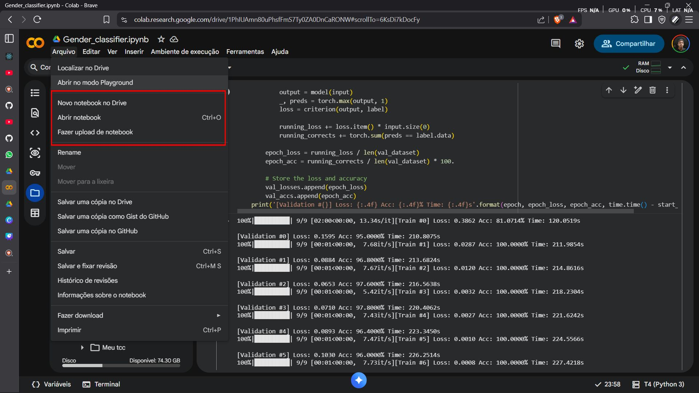
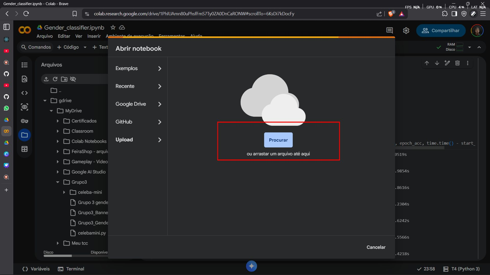
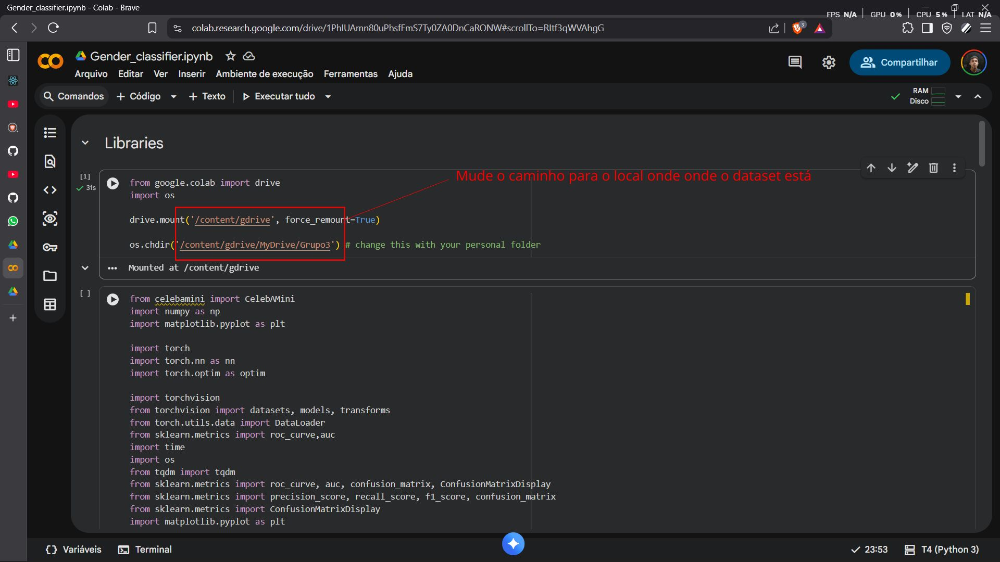
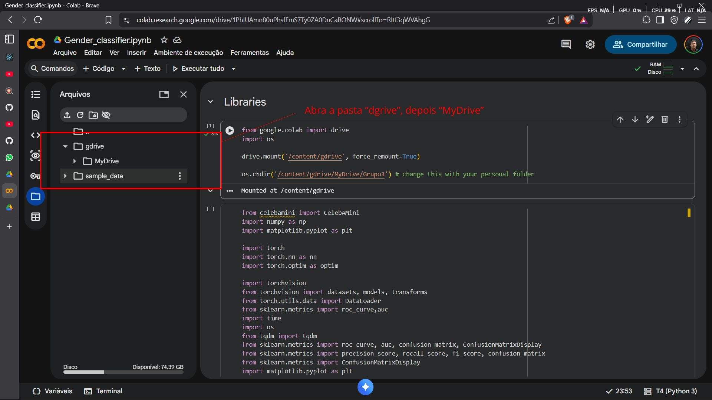
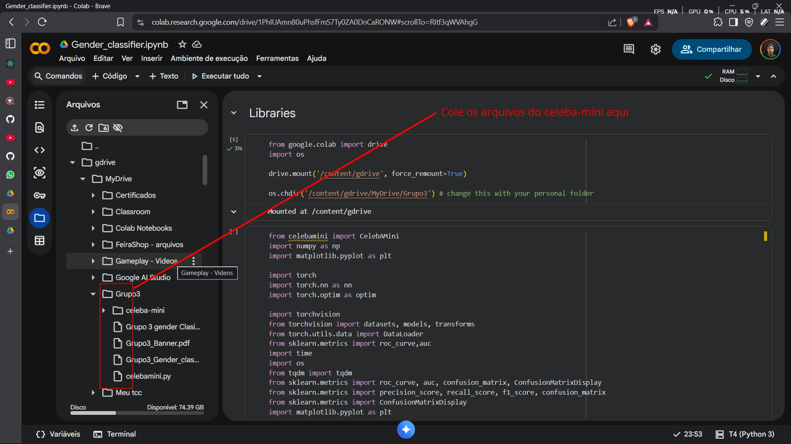
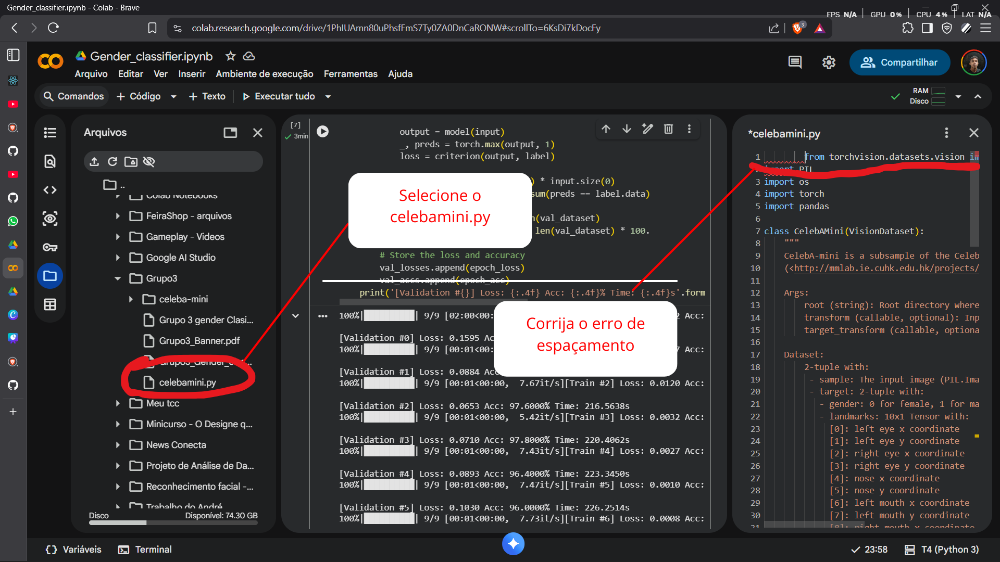
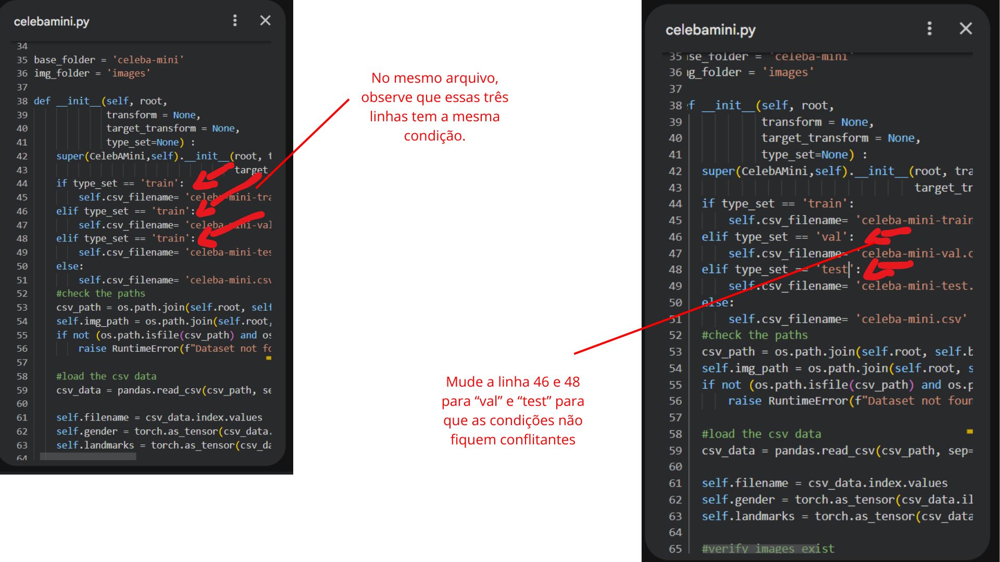

# Antes de tudo, siga o passo a passo a baixo para adicionar o script em um novo projeto notebook-lm:

Clique em "Abrir Notebook":



Depois clique em "Upload" e em "Procurar":



<h3>Depois de adicionar o projeto, algumas configurações devem ser feitas:</h3>

Aponte para o local correto da pasta usando o drive:


Navegue para o local correto:





# ☢️❌ Algumas prevenções de erro: 

Em alguns casos, como foi o meu, o arquivo ```cebelamini.py``` ficou bugado por conta de alguns erros que tinham no código. A baixo vou mostrar como resolver esses erros.


Primeiro erro (e mais simples): Espaçamento incorreto no ```cebelamini.py```:



Segundo erro mais comum: Condições do ```cebelamini.py``` duplicadas:



Seguindo todo esse passo a passo, acredito que dê tudo certo pra vcs familia. Tmj demais 🙂👊

2005 | Victor S. 🔱🪽